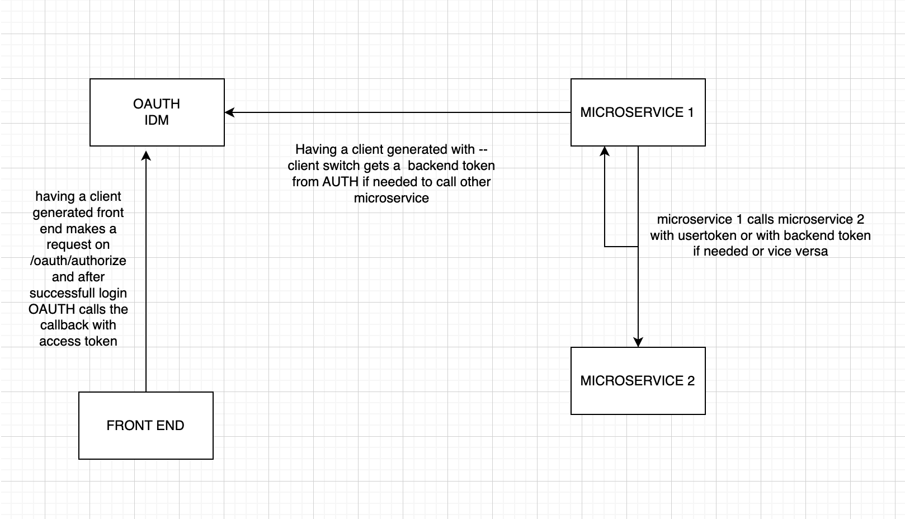

# Laravel Microservices
A laravel microservice implementation. The repo will contain 
one microservice called idm (identity management) and another microservice called
posts. The idm microservice will be responsible for user authentication and registration of users.
For the OAuth2 implementation, I will be using the laravel passport package.
For the Authentication, I will be using the laravel breeze package.




## Installation
cd into the identity-manager directory and run the following commands
```bash
composer install
php artisan migrate
php artisan passport:install
php artisan passport:key
```
